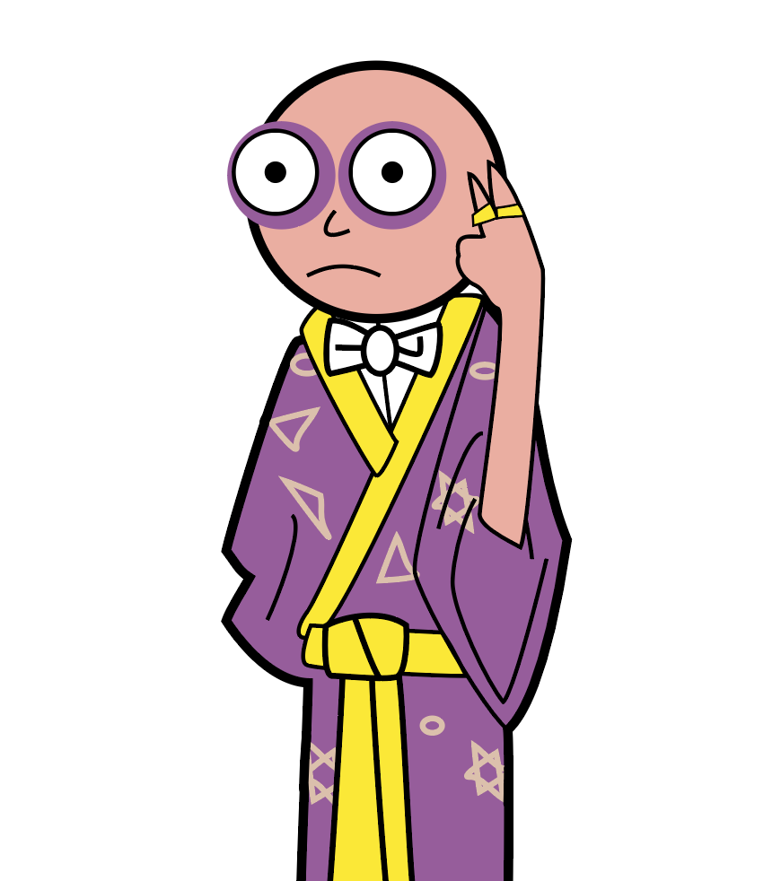

# Individual-NumberWizard

## Individual-NumberWizard2D, guessing game
Developed on MacOS High Sierra with Unity Version 2018.2.12f1.
Target platform: WebGL

Desc: A player thinks of a number. The System guesses a number (min+max)/2 as long as the guess isn't equal to the secret number. After each system's guess, the player confirms with eighter "lower", "higher" or "equal".
------

GameMechanics:

guess = ( min + max ) / 2

if secret number < guess --> max = guess

if secret nubmer > guess --> min = guess
----
